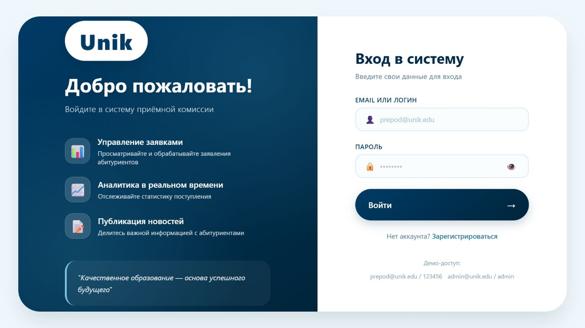
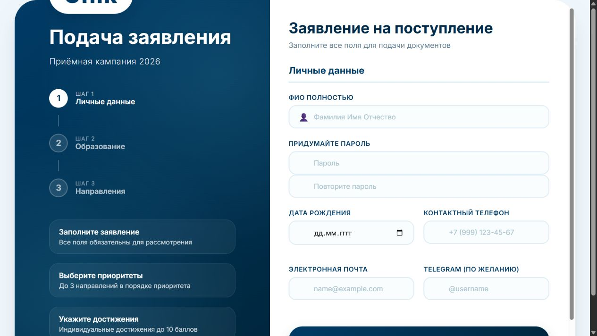
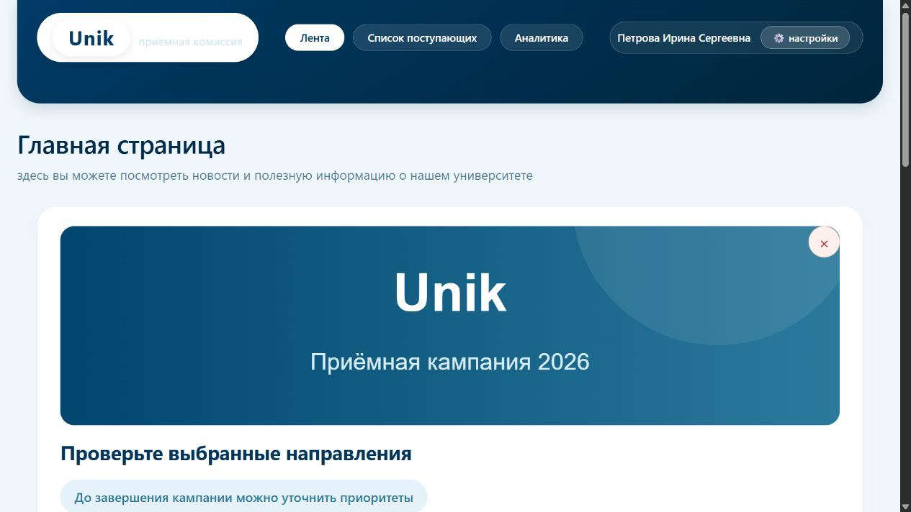
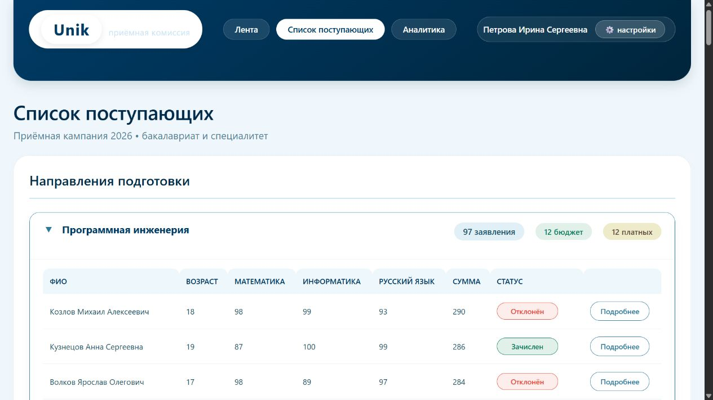
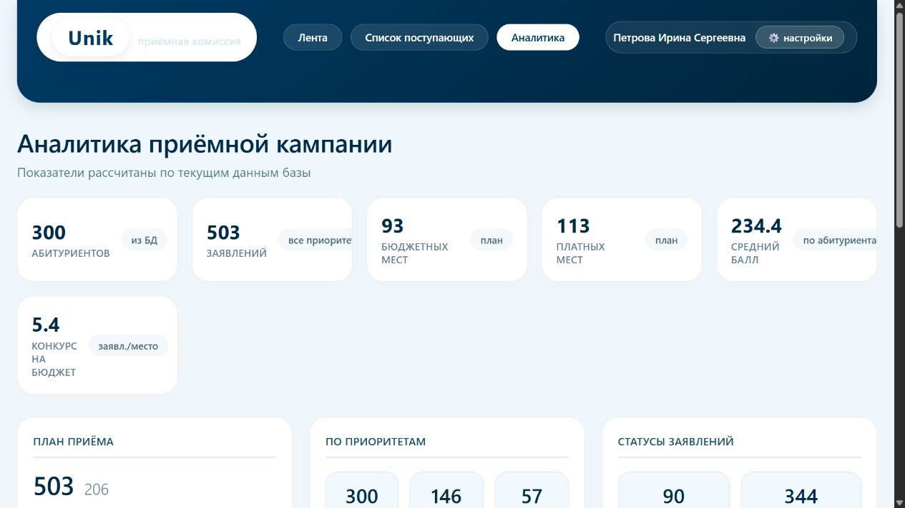
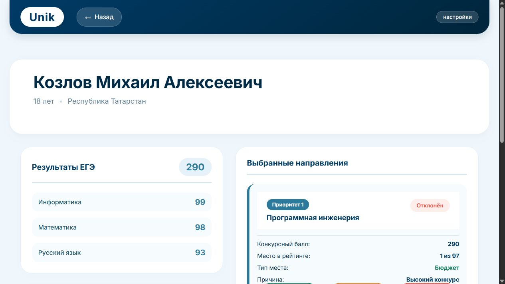
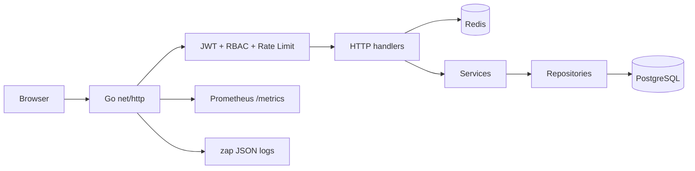

# Unik Admissions Portal

Production-ready учебный портал приёмной кампании университета. Приложение написано на Go, использует PostgreSQL как основное хранилище, Redis для кеширования и распределённого rate limiting, а существующий интерфейс обслуживается через серверные Go-шаблоны.

## Возможности

- регистрация и авторизация абитуриентов;
- роли `student`, `admissions` и `analyst`;
- JWT в защищённой `HttpOnly` cookie;
- личный кабинет с ЕГЭ, достижениями, приоритетами и местом в рейтинге;
- рейтинг поступающих по направлениям;
- управление новостями приёмной комиссией;
- изменение статусов заявлений;
- аналитика по реальным данным PostgreSQL;
- Redis cache-aside и распределённое ограничение частоты запросов;
- health checks, Prometheus-метрики и структурированные логи.

## Интерфейс

Все изображения ниже сделаны из реально запущенного приложения с демонстрационной базой из 300 абитуриентов.

### Вход



### Регистрация абитуриента



### Новости приёмной комиссии



### Рейтинг поступающих



### Аналитика приёмной кампании



### Личный кабинет



## Архитектура



Основные решения:

- `net/http` и `html/template` без тяжёлого веб-фреймворка;
- `pgxpool` с ограниченным пулом соединений и health checks;
- встроенные SQL-миграции под PostgreSQL advisory lock;
- bcrypt для паролей и HMAC-SHA256 для JWT;
- cache-aside: при ошибке чтения кеша запрос безопасно выполняется через PostgreSQL;
- явная инвалидация кеша после создания/удаления новости, регистрации и изменения статуса;
- Redis Lua script для атомарного rate limiting между несколькими экземплярами API;
- request ID, recovery middleware, security headers и graceful shutdown;
- multi-stage Docker image, непривилегированный пользователь и read-only filesystem;
- автоматические unit/integration-тесты в GitHub Actions.

## Стек

| Область | Технология |
|---|---|
| Backend | Go, `net/http`, `html/template` |
| Database | PostgreSQL, `pgx/v5`, `pgxpool` |
| Cache | Redis, `go-redis/v9` |
| Observability | Prometheus metrics, `zap` |
| Security | bcrypt, JWT, RBAC, distributed rate limiting |
| Infrastructure | Docker, Docker Compose, Makefile, GitHub Actions |
| API contract | OpenAPI 3.1, Swagger UI, ReDoc |

## Быстрый старт

Требуются Docker и Docker Compose:

```powershell
docker compose up --build -d
docker compose ps
```

После успешного старта:

- сайт: `http://localhost:8000`;
- Swagger UI: `http://localhost:8000/api/docs`;
- ReDoc: `http://localhost:8000/api/redoc`;
- readiness: `http://localhost:8000/health/ready`;
- Prometheus metrics: `http://localhost:8000/metrics`;
- PostgreSQL: `localhost:5433`;
- Redis: `localhost:6380`.

При первом запуске API автоматически применит миграции, заполнит направления и создаст служебных пользователей:

| Роль | Логин | Пароль |
|---|---|---|
| Приёмная комиссия | `admin@unik.edu` | `admin` |
| Аналитик | `prepod@unik.edu` | `123456` |

Остановка:

```powershell
docker compose down
```

PostgreSQL хранится в Docker volume `unik_pgdata`. Redis используется как восстанавливаемый кеш и запускается без persistence.

## Демонстрационные данные

Команда полностью заменяет данные приложения и создаёт:

- 300 абитуриентов;
- 503 заявления по десяти направлениям;
- реалистичные баллы, приоритеты и статусы;
- три новости;
- две служебные учётные записи.

```powershell
docker compose --profile tools run --rm seed
```

Пароль всех демонстрационных студентов — `student123`. Логины: `student001@demo.unik`, `student002@demo.unik` и далее.

Локальная seed-команда требует явного флага, защищающего от случайного удаления данных:

```powershell
go run ./cmd/seed --confirm
```

## Локальная разработка

Запустите инфраструктуру:

```powershell
docker compose up -d db redis
Copy-Item .env.template .env
```

Запустите API:

```powershell
go run ./cmd/api
```

Основные Makefile-команды:

```bash
make run
make build
make check
make seed
```

## Redis

| Ключ | Данные | TTL | Инвалидация |
|---|---|---:|---|
| `cache:directions` | направления и предметы | 15 минут | при bootstrap приложения |
| `cache:news` | список новостей | 2 минуты | создание или удаление новости |
| `cache:summary` | агрегированная статистика | 1 минута | регистрация или изменение статуса |

Все ключи получают namespace из `REDIS_KEY_PREFIX`. Пароли, JWT и персональные карточки абитуриентов в Redis не сохраняются.

Rate limiting по умолчанию:

- вход: 10 попыток за 5 минут для пары IP + логин;
- регистрация: 5 запросов за 10 минут с одного IP;
- клиент получает `429 Too Many Requests` и заголовок `Retry-After`;
- `RATE_LIMIT_FAIL_OPEN=true` позволяет приложению продолжить работу при временной недоступности Redis. Для более строгого контура можно установить `false`.

## Тестирование

Обычные проверки не требуют внешних сервисов:

```powershell
go mod verify
go test ./...
go vet ./...
go build ./...
docker compose config --quiet
```

Unit-тесты покрывают JWT, валидацию регистрации, совместимость с форматом JavaScript-формы, Redis cache lifecycle, Lua rate limiter, production-конфигурацию, шаблоны и Prometheus-метрики.

Интеграционные тесты используют отдельные PostgreSQL и Redis и намеренно не подключаются к рабочей базе:

```bash
make integration-up
make test-integration
make integration-down
```

Проверяемый e2e-сценарий включает миграции, bootstrap, регистрацию, cookie-login, новости, cache hit, статистику, смену статуса, readiness и `/metrics`.

CI-конфигурация находится в `.github/workflows/ci.yml`: она запускает unit/integration tests с race detector, `go vet`, проверку форматирования, сборку бинарников, валидацию Compose и Docker build.

## Наблюдаемость

`zap` пишет структурированные события о старте, завершении, миграциях, Redis и каждом HTTP-запросе. В лог запроса входят:

- `request_id`;
- метод и route pattern;
- HTTP-статус и размер ответа;
- длительность;
- адрес клиента.

`GET /metrics` экспортирует:

- количество и latency HTTP-запросов;
- число активных запросов;
- cache hit/miss/write/invalidate/error;
- решения rate limiter;
- стандартные Go runtime и process metrics.

Для production endpoint `/metrics` следует публиковать только во внутренней сети или закрывать на reverse proxy.

## Конфигурация

Основной пример находится в `.env.template`.

| Переменная | Назначение | Default |
|---|---|---|
| `APP_ENV` | окружение | `development` |
| `HTTP_ADDR` | адрес API | `:8000` |
| `DATABASE_URL` | PostgreSQL DSN | локальный PostgreSQL |
| `REDIS_URL` | Redis DSN | локальный Redis |
| `REDIS_KEY_PREFIX` | namespace ключей | `unik:v1:` |
| `SECRET_KEY` | ключ подписи JWT | только dev-значение |
| `ACCESS_TOKEN_TTL` | срок жизни JWT | `24h` |
| `COOKIE_SECURE` | cookie только через HTTPS | `false` |
| `DIRECTIONS_CACHE_TTL` | кеш направлений | `15m` |
| `NEWS_CACHE_TTL` | кеш новостей | `2m` |
| `SUMMARY_CACHE_TTL` | кеш статистики | `1m` |
| `LOGIN_RATE_LIMIT` | попыток входа за окно | `10` |
| `LOGIN_RATE_WINDOW` | окно входа | `5m` |
| `REGISTRATION_RATE_LIMIT` | регистраций за окно | `5` |
| `REGISTRATION_RATE_WINDOW` | окно регистрации | `10m` |
| `RATE_LIMIT_FAIL_OPEN` | поведение без Redis | `true` |
| `SHUTDOWN_TIMEOUT` | graceful shutdown | `10s` |

При `APP_ENV=production` API не запустится с `SECRET_KEY` короче 32 символов. Для боевого окружения необходимо включить `COOKIE_SECURE=true`, использовать TLS/reverse proxy и передавать секреты через secret manager.

## Структура проекта

```text
cmd/
|-- api/                    # HTTP-приложение
`-- seed/                   # CLI генерации демо-данных
internal/
|-- auth/                   # JWT
|-- cache/                  # Redis cache и rate limiter
|-- config/                 # env-конфигурация
|-- database/               # pgxpool и SQL-миграции
|-- domain/                 # предметные модели
|-- httpserver/             # handlers, middleware, view models
|-- observability/          # Prometheus metrics
|-- repository/             # SQL-запросы
|-- seed/                   # генератор данных
`-- service/                # бизнес-логика
tests/integration/          # e2e тест PostgreSQL + Redis + HTTP
app/
|-- static/                 # CSS, JavaScript, favicon
`-- templates/              # Go HTML templates
docs/screenshots/           # актуальные скриншоты сайта
api/openapi.yaml            # OpenAPI 3.1
docker-compose.yml          # основной стек
docker-compose.test.yml     # изолированная test-инфраструктура
Dockerfile
Makefile
```

Миграции из `internal/database/migrations` встраиваются в бинарник через `embed`, выполняются по порядку под PostgreSQL advisory lock и фиксируются в таблице `schema_migrations`.
